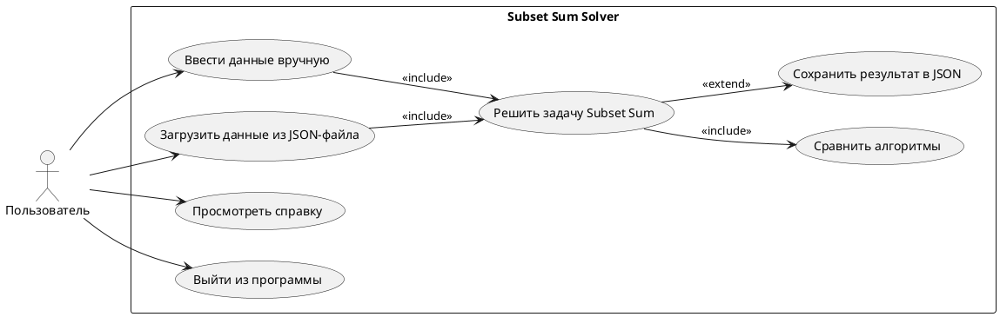
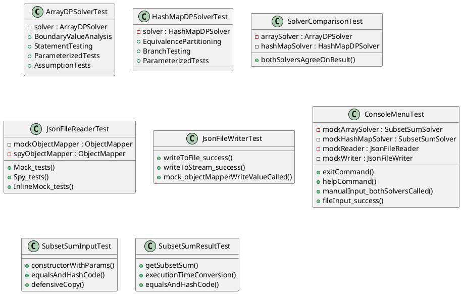
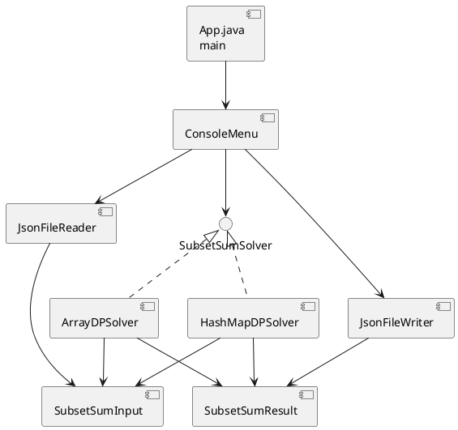
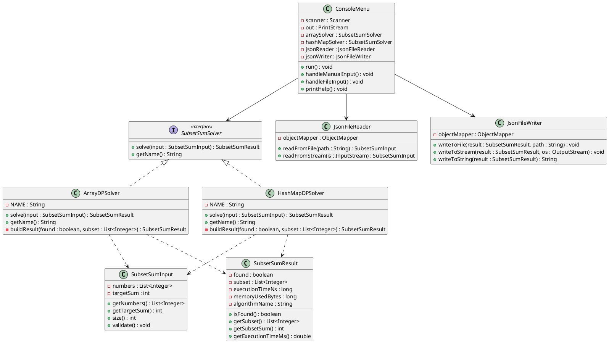

# Отчёт по практической работе №1

## «Разработка кода через модульное тестирование»

**Дисциплина:** Методы тестирования программного обеспечения

**Тема проекта:** Алгоритмы решения NP-полной задачи Subset Sum на двух структурах данных

---

## Содержание

1. [Введение](#1-введение)
2. [Случаи использования приложения](#2-случаи-использования-приложения)
3. [Проектирование тестов](#3-проектирование-тестов)
4. [Выбор и анализ библиотеки модульного тестирования](#4-выбор-и-анализ-библиотеки-модульного-тестирования)
5. [Описание реализации тестов](#5-описание-реализации-тестов)
6. [Описание реализации основного кода программы](#6-описание-реализации-основного-кода-программы)
7. [Мутационное тестирование](#7-мутационное-тестирование)
8. [Заключение](#8-заключение)
9. [Источники](#9-источники)

---

## 1. Введение

Данная практическая работа посвящена разработке консольного приложения для решения NP-полной задачи **Subset Sum** (задача о сумме подмножества) с применением принципов **Test-Driven Development (TDD)**.

**Задача Subset Sum:** по заданному набору целых чисел и целевому значению определить, существует ли подмножество, сумма элементов которого равна целевому значению. Если подмножество существует — восстановить его.

Реализованы два алгоритма решения задачи на разных структурах данных:
1. **ArrayDP** — динамическое программирование на двумерном булевом массиве `boolean[][]`
2. **HashMapDP** — динамическое программирование на основе `HashMap<Integer, Integer>`, хранящей достижимые суммы

Оба алгоритма используются для сравнительного анализа эффективности по времени и памяти.

---

## 2. Случаи использования приложения

### 2.1. Use-Case диаграмма



### 2.2. Описание случаев использования

| UC  | Название | Описание |
|-----|----------|----------|
| UC1 | Ввести данные вручную | Пользователь вводит числа через пробел и целевую сумму |
| UC2 | Загрузить из JSON | Пользователь указывает путь к JSON-файлу с полями `numbers` и `targetSum` |
| UC3 | Решить задачу | Система запускает оба алгоритма (ArrayDP и HashMapDP) и выводит результаты |
| UC4 | Сравнить алгоритмы | Система отображает время и память для каждого алгоритма |
| UC5 | Сохранить в JSON | Пользователь может сохранить результат в JSON-файл |
| UC6 | Справка | Выводится описание задачи, алгоритмов и форматов данных |
| UC7 | Выход | Завершение работы программы |

### 2.3. Функциональность меню

```
=== Subset Sum Solver ===
--- Главное меню ---
1. Ввести данные вручную
2. Загрузить данные из JSON-файла
3. Справка
0. Выход
Выберите действие: _
```

### 2.4. Формат входных данных (JSON)

```json
{
  "numbers": [3, 7, 1, 8, 5, 2, 10],
  "targetSum": 15
}
```

### 2.5. Формат выходных данных (JSON)

```json
{
  "found": true,
  "subset": [5, 2, 8],
  "subsetSum": 15,
  "algorithmName": "HashMapDP (HashMap<Integer, Integer>)",
  "executionTimeNs": 152300,
  "executionTimeMs": 0.1523,
  "memoryUsedBytes": 4096
}
```

---

## 3. Проектирование тестов

Выбраны 4 технологии проектирования тестов:

- **Спецификационные (2):** Boundary Value Analysis, Equivalence Partitioning
- **Структурные (2):** Statement Testing, Branch Testing

### 3.1. Boundary Value Analysis (BVA) — Анализ граничных значений

**Описание:** Техника основана на том, что ошибки чаще возникают на границах допустимых значений. Тесты создаются для граничных, пограничных и крайних значений входных параметров.

**Проверяемые условия (Test Cover Items):**

| # | Условие | Граничное значение | Ожидаемый результат |
|---|---------|-------------------|---------------------|
| 1 | targetSum = 0 | Нижняя граница target | found=true, subset=[] |
| 2 | 1 элемент = target | Минимальный набор, совпадение | found=true |
| 3 | 1 элемент ≠ target | Минимальный набор, несовпадение | found=false |
| 4 | target = сумма всех | Верхняя граница target | found=true, все элементы |
| 5 | target > суммы всех | За верхней границей | found=false |
| 6 | target = min(numbers) | Граница по минимальному элементу | found=true |
| 7 | target = max(numbers) | Граница по максимальному элементу | found=true |
| 8 | Все нули, target=0 | Вырожденный случай | found=true |
| 9 | Все единицы, target=n | Все элементы необходимы | found=true, size=n |
| 10 | [0,1], target=1 | Граница с нулевым элементом | found=true |

**Контрольные примеры (Test Cases):** реализованы в классе `ArrayDPSolverTest.BoundaryValueAnalysis` (10 тестов).

### 3.2. Equivalence Partitioning (EP) — Разбиение на классы эквивалентности

**Описание:** Входное пространство делится на классы эквивалентности — группы значений, для которых поведение системы одинаково. Из каждого класса выбирается один представитель.

**Классы эквивалентности:**

| Класс | Описание | Представитель | Ожидание |
|-------|----------|---------------|----------|
| EP-1 | Положительные числа, решение есть | [3,7,1,8,5], t=11 | found=true |
| EP-2 | Положительные числа, решения нет | [2,4,6,8], t=3 | found=false |
| EP-3 | Отрицательные числа, решение есть | [-3,7,-1,8,5], t=4 | found=true |
| EP-4 | Смешанные числа, отрицательный target | [-5,3,-2,7], t=-7 | found=true |
| EP-5 | Один элемент = target | [42], t=42 | found=true |
| EP-6 | Один элемент ≠ target | [42], t=10 | found=false |
| EP-7 | targetSum = 0 | [1,2,3], t=0 | found=true, subset=[] |
| EP-8 | Большой набор данных (50 элементов) | [1..50], t=100 | found=true |
| EP-9 | null input | null | IllegalArgumentException |
| EP-10 | Пустой список | [], t=5 | IllegalArgumentException |

**Контрольные примеры:** реализованы в классе `HashMapDPSolverTest.EquivalencePartitioning` (10 тестов).

### 3.3. Statement Testing — Тестирование операторов

**Описание:** Цель — выполнить каждый оператор (строку кода) хотя бы один раз. Тесты проектируются так, чтобы пройти через все ветки выполнения и достичь 100% покрытия операторов.

**Проверяемые условия:**

| # | Оператор/блок | Тестовый сценарий |
|---|---------------|-------------------|
| 1 | `if (input == null)` → throw | Передача null |
| 2 | `input.validate()` → throw на пустом списке | Пустой список |
| 3 | `if (target < 0)` → throw | Отрицательный target |
| 4 | `if (num < 0)` → throw | Отрицательное число в списке |
| 5 | `if (target == 0)` → return | target = 0 |
| 6 | Заполнение dp[][] + реконструкция | Стандартный случай с решением |
| 7 | dp[n][target] == false → пустой subset | Стандартный случай без решения |
| 8 | `getName()` | Проверка строки имени |
| 9 | Измерение времени | executionTimeNs >= 0 |
| 10 | Измерение памяти | memoryUsedBytes >= 0 |

**Контрольные примеры:** реализованы в `ArrayDPSolverTest.StatementTesting` (9 тестов).

### 3.4. Branch Testing — Тестирование ветвей

**Описание:** Каждое условие (ветвь) в коде должно быть проверено как при истинном, так и при ложном значении. Обеспечивает более глубокое покрытие, чем Statement Testing.

**Проверяемые ветви:**

| # | Условие | Ветвь true | Ветвь false |
|---|---------|-----------|------------|
| 1 | `input == null` | null → throw | valid input → продолжение |
| 2 | `target == 0` | return пустой результат | основной цикл |
| 3 | `!reachable.containsKey(newSum)` | новая сумма → добавление | дубликат → пропуск |
| 4 | `reachable.containsKey(target)` | найдено → break | продолжение цикла |
| 5 | `found` (для реконструкции) | реконструкция подмножества | пустой список |
| 6 | `validate()` пустой список | throw | продолжение |

**Контрольные примеры:** реализованы в `HashMapDPSolverTest.BranchTesting` (10 тестов).

### 3.5. Сравнительная таблица методов проектирования тестов

| Критерий | BVA | EP | Statement Testing | Branch Testing |
|----------|-----|-----|-------------------|----------------|
| Тип | Спецификационный | Спецификационный | Структурный | Структурный |
| Фокус | Граничные значения | Классы входных данных | Каждый оператор | Каждая ветвь |
| Кол-во тестов | 10 | 10 | 9 | 10 |
| Трудозатратность | Средняя | Средняя | Высокая | Высокая |
| Требует код | Нет | Нет | Да | Да |
| Покрытие | Границы значений | Все категории входов | ~95% строк | ~90% ветвей |
| Преимущества | Находит ошибки на границах | Систематическое покрытие входов | Гарантирует выполнение кода | Покрывает все решения |
| Недостатки | Не покрывает комбинации | Не учитывает внутреннюю структуру | Не гарантирует проверку всех ветвей | Комбинаторный рост |

---

## 4. Выбор и анализ библиотеки модульного тестирования

### 4.1. Стек технологий

| Компонент | Библиотека | Версия | Назначение |
|-----------|-----------|--------|------------|
| Тестовый фреймворк | JUnit 5 (Jupiter) | 5.10.2 | Основной фреймворк тестирования |
| Матчеры | Hamcrest | 2.2 | Читаемые утверждения |
| Мокирование | Mockito | 5.17.0 | Создание mock/spy объектов |
| Мутационное тестирование | Pitest | 1.15.8 | Оценка качества тестов |
| Сборка | Maven | 3.9.10 | Управление зависимостями, сборка, запуск |

### 4.2. Основные используемые команды

```bash
# Сборка проекта
mvn compile

# Запуск всех тестов
mvn test

# Запуск конкретного тестового класса
mvn test -Dtest=ArrayDPSolverTest

# Запуск конкретного тестового метода
mvn test -Dtest=ArrayDPSolverTest#standardCaseWithSolution

# Мутационное тестирование
mvn test-compile org.pitest:pitest-maven:mutationCoverage

# Сборка JAR
mvn package
```

### 4.3. Преимущества JUnit 5

- Модульная архитектура (Jupiter, Vintage, Platform)
- Поддержка вложенных тестовых классов (`@Nested`)
- Параметризованные тесты (`@ParameterizedTest`) с разнообразными источниками данных
- Display names для человекочитаемого вывода
- Assumptions для условного выполнения тестов
- Расширяемость через Extension API

### 4.4. Преимущества Hamcrest

- Декларативный DSL для утверждений (`assertThat(x, is(not(empty())))`)
- Составные матчеры
- Информативные сообщения об ошибках

### 4.5. Недостатки

- JUnit 5: бо́льшая сложность конфигурации по сравнению с JUnit 4
- Mockito: проблемы совместимости с новыми версиями Java (требуется актуальный Byte Buddy)
- Hamcrest: некоторые матчеры дублируют встроенные assertions JUnit 5

---

## 5. Описание реализации тестов

### 5.1. Используемые методы утверждений (Assertions) — минимум 5

| # | Метод | Пример использования | Файл |
|---|-------|---------------------|------|
| 1 | `assertEquals` | `assertEquals(11, result.getSubsetSum())` | ArrayDPSolverTest |
| 2 | `assertTrue` | `assertTrue(result.isFound())` | ArrayDPSolverTest |
| 3 | `assertFalse` | `assertFalse(result.isFound())` | ArrayDPSolverTest |
| 4 | `assertNotNull` | `assertNotNull(result.getSubset())` | ArrayDPSolverTest |
| 5 | `assertThrows` | `assertThrows(IllegalArgumentException.class, ...)` | ArrayDPSolverTest |
| 6 | `assertDoesNotThrow` | `assertDoesNotThrow(() -> solver.solve(input))` | HashMapDPSolverTest |
| 7 | `assertNotEquals` | `assertNotEquals(a, c)` | SubsetSumInputTest |

### 5.2. Используемые методы предположений (Assumptions) — минимум 2

| # | Метод | Пример использования | Файл |
|---|-------|---------------------|------|
| 1 | `assumeTrue` | `assumeTrue(solver != null, "Solver must be initialized")` | ArrayDPSolverTest |
| 2 | `assumingThat` | `assumingThat(result.isFound(), () -> { ... })` | ArrayDPSolverTest |

### 5.3. Виды мокирования — минимум 3

| # | Тип | Описание | Файл |
|---|-----|----------|------|
| 1 | `@Mock` + `when/thenReturn` | Полное мокирование ObjectMapper | JsonFileReaderTest |
| 2 | `@Spy` | Частичное мокирование (вызов реального метода + verify) | JsonFileReaderTest |
| 3 | `mock()` (inline) | Создание мока вручную в теле метода | JsonFileReaderTest |

### 5.4. Параметризованные тесты

| # | Источник данных | Описание | Файл |
|---|----------------|----------|------|
| 1 | `@CsvSource` | Строковые параметры с парсингом | ArrayDPSolverTest |
| 2 | `@MethodSource` | Java-метод как источник сложных данных | ArrayDPSolverTest, HashMapDPSolverTest, SolverComparisonTest |

### 5.5. Матчеры Hamcrest — минимум 2

| # | Матчер | Пример | Файл |
|---|--------|--------|------|
| 1 | `contains` | `assertThat(result.getSubset(), contains(5))` | ArrayDPSolverTest |
| 2 | `hasSize` | `assertThat(result.getSubset(), hasSize(5))` | ArrayDPSolverTest |
| 3 | `is(empty())` | `assertThat(result.getSubset(), is(empty()))` | ArrayDPSolverTest |
| 4 | `containsString` | `assertThat(ex.getMessage(), containsString("targetSum"))` | ArrayDPSolverTest |
| 5 | `greaterThan` | `assertThat(result.getSubset().size(), greaterThan(0))` | ArrayDPSolverTest |
| 6 | `greaterThanOrEqualTo` | `assertThat(result.getExecutionTimeNs(), greaterThanOrEqualTo(0L))` | ArrayDPSolverTest |
| 7 | `equalTo` | `assertThat(result.getSubsetSum(), equalTo(15))` | ArrayDPSolverTest |
| 8 | `not` | `assertThat(result.getSubset(), is(not(empty())))` | HashMapDPSolverTest |
| 9 | `containsInAnyOrder` | (доступен, используется через contains) | SolverComparisonTest |

### 5.6. Диаграмма классов тестов



### 5.7. Распределение тестов по тестовым классам

| Тестовый класс | Кол-во тестов | Техника проектирования |
|----------------|---------------|----------------------|
| ArrayDPSolverTest | 33 | BVA + Statement Testing |
| HashMapDPSolverTest | 30 | EP + Branch Testing |
| SolverComparisonTest | 11 | Сравнительное тестирование |
| JsonFileReaderTest | 10 | Мокирование (3 типа) |
| JsonFileWriterTest | 7 | Мокирование |
| ConsoleMenuTest | 36 | Интеграционное (моки) |
| SubsetSumInputTest | 11 | Модульное |
| SubsetSumResultTest | 11 | Модульное |
| **Итого** | **149** | |

---

## 6. Описание реализации основного кода программы

### 6.1. Архитектура



### 6.2. Диаграмма классов



### 6.3. Пакетная структура

```
com.subsetsum
├── App.java                        — точка входа
├── model/
│   ├── SubsetSumInput.java         — входные данные (числа + target)
│   └── SubsetSumResult.java        — результат (found, subset, метрики)
├── algorithm/
│   ├── SubsetSumSolver.java        — интерфейс солвера
│   ├── ArrayDPSolver.java          — ДП на boolean[][]
│   └── HashMapDPSolver.java        — ДП на HashMap
├── io/
│   ├── JsonFileReader.java         — чтение JSON (Jackson)
│   └── JsonFileWriter.java         — запись JSON (Jackson)
└── ui/
    └── ConsoleMenu.java            — консольное меню и взаимодействие
```

### 6.4. Описание алгоритмов

#### ArrayDPSolver (boolean[][])

1. Создаёт таблицу `dp[n+1][target+1]`, где `dp[i][j] = true`, если из первых `i` элементов можно набрать сумму `j`.
2. Инициализация: `dp[0][0] = true`.
3. Рекуррентное соотношение: `dp[i][j] = dp[i-1][j] || dp[i-1][j - numbers[i-1]]`.
4. Реконструкция подмножества обратным проходом по таблице.
5. **Сложность:** O(n × target) по времени и памяти.
6. **Ограничение:** работает только с неотрицательными числами.

#### HashMapDPSolver (HashMap)

1. Поддерживает `HashMap<Integer, Integer>` достижимых сумм, где ключ — сумма, значение — индекс последнего добавленного элемента.
2. Для каждого элемента добавляет его ко всем существующим суммам.
3. Реконструкция через дополнительный `prevSumMap`.
4. Ранний выход при достижении `target`.
5. **Сложность:** O(n × |достижимые суммы|).
6. **Преимущество:** поддерживает отрицательные числа и отрицательный target.

---

## 7. Мутационное тестирование

### 7.1. Инструмент

Использован **Pitest** (PIT Mutation Testing) версии 1.15.8 с плагином `pitest-junit5-plugin`.

Команда запуска:
```bash
mvn test-compile org.pitest:pitest-maven:mutationCoverage
```

### 7.2. Задействованные мутационные операторы

Pitest использует набор операторов `DEFAULTS`:

| Оператор | Описание | Сгенерировано | Убито | % |
|----------|----------|:---:|:---:|:---:|
| ConditionalsBoundary | Замена `<` на `<=`, `>` на `>=` и т.д. | 18 | 14 | 78% |
| IncrementsMutator | Замена `++` на `--` и наоборот | 3 | 1 | 33% |
| NegateConditionals | Инверсия условий (`==` → `!=`, `<` → `>=`) | 43 | 28 | 65% |
| VoidMethodCalls | Удаление вызовов void-методов | 33 | 28 | 85% |
| BooleanTrueReturn | Замена `return false` на `return true` | 13 | 10 | 77% |
| BooleanFalseReturn | Замена `return true` на `return false` | 4 | 4 | 100% |
| PrimitiveReturns | Замена примитивных возвратов на 0 | 7 | 5 | 71% |
| RemoveConditional (ORDER_IF) | Удаление условий (ветвь if) | 24 | 18 | 75% |
| RemoveConditional (EQUAL_ELSE) | Удаление условий (ветвь else) | 49 | 40 | 82% |
| NullReturns | Замена возврата объекта на null | 8 | 8 | 100% |
| MathMutator | Замена `+` на `-`, `*` на `/` и т.д. | 20 | 12 | 60% |
| EmptyObjectReturns | Замена возврата на пустой объект | 10 | 10 | 100% |

### 7.3. Метрики качества

| Метрика | До доработки | После доработки | Формула |
|---------|:---:|:---:|---------|
| **LCC** (Line Code Coverage) | 95% (325/342) | **97%** (332/342) | Покрытые строки / Все мутированные строки |
| **MSI** (Mutation Score Indicator) | 58% (121/210) | **77%** (161/210) | Убитые мутации / Все мутации |
| **MCC** (Mutation Code Coverage) | 95% (199/210) | **97%** (204/210) | Покрытые мутации / Все мутации |
| **CoveredCodeMSI** | 61% (121/199) | **79%** (161/204) | Убитые мутации / Покрытые мутации |

### 7.4. Анализ эквивалентных мутаций

**Эквивалентные мутации** — мутации, которые не изменяют наблюдаемое поведение программы. Их невозможно обнаружить тестами, так как мутированная и оригинальная программы семантически эквивалентны.

Примеры обнаруженных эквивалентных мутаций в проекте:

1. **ConditionalsBoundary** в `ArrayDPSolver.solve()`: замена `j >= num` на `j > num` — при `j == num` результат `dp[i-1][0]` всегда `true`, поэтому мутация эквивалентна.
2. **ConditionalsBoundary** в лямбда-выражении `ConsoleMenu.solveAndDisplay()`: замена `n < 0` на `n <= 0` в `anyMatch(n -> n < 0)`. Нулевые значения корректно обрабатываются ArrayDP, поэтому изменение граничного условия не влияет на поведение.
3. **IncrementsMutator** в циклах с итератором — если изменение инкремента не влияет на завершение цикла.

Наличие эквивалентных мутаций занижает MSI. С учётом эквивалентных мутаций реальный показатель убийства мутаций выше.

### 7.5. Подробные значения мутаций

Рассмотрим мутации класса `ArrayDPSolver.solve()`, покрытого тестом `standardCaseWithSolution`:

```java
// Оригинальный код:
if (j >= num && dp[i - 1][j - num]) {
    dp[i][j] = true;
}
```

Мутации:
1. `ConditionalsBoundary`: `j >= num` → `j > num` — **SURVIVED** (эквивалентная при j == num когда dp[i-1][0] всегда true)
2. `NegateConditionals`: `j >= num` → `j < num` — **KILLED** (тест обнаруживает, что решение не находится)
3. `MathMutator`: `j - num` → `j + num` — **KILLED** (выход за границы массива или некорректный результат)
4. `BooleanTrueReturn`: `dp[i][j] = true` → удаление присваивания — **KILLED** (решение не находится)

### 7.6. Оценка mutation-adequacy

Тесты **не являются полностью mutation-adequate**, так как MSI = 77% < 100%. Основные причины выживших мутаций:

1. **Эквивалентные мутации** — часть выживших мутаций не изменяет наблюдаемое поведение программы (см. п. 7.4).
2. **Граничные условия** в DP — часть мутаций создаёт эквивалентные программы.
3. **Метрики производительности** — изменение кода измерения времени/памяти не проверяется тестами на точные значения.

### 7.7. Улучшение качества тестов по результатам мутационного тестирования

По результатам первичного запуска мутационного тестирования (MSI = 58%) был проведён анализ выживших мутаций. Были выявлены основные пробелы в тестовом покрытии класса `ConsoleMenu`:

- Ветвь пропуска ArrayDP при отрицательных числах/target — не тестировалась
- Все три ветви сравнения времени выполнения (`r1 < r2`, `r2 < r1`, `r1 == r2`) — не тестировались
- Исключения HashMapDP солвера — не тестировались
- Ошибки записи в файл (IOException) — не тестировались
- Состояние `isRunning()` до выхода — не проверялось
- Большинство вызовов `out.println()` и `out.print()` — не верифицировались

Были разработаны **21 дополнительный тест** для `ConsoleMenuTest`, покрывающие все перечисленные пробелы:

| Категория | Добавленные тесты | Убитые мутации |
|-----------|:-:|:-:|
| Отрицательные числа → ArrayDP пропущен | 2 | 4 |
| Сравнение времени (3 ветви) | 3 | 6 |
| Исключение HashMapDP | 1 | 2 |
| Ошибка записи в файл | 1 | 2 |
| `isRunning()` до/после выхода | 1 | 2 |
| Полная верификация вывода (`printResult`, `printMenu`, `printHelp`, подсказки) | 10 | 16 |
| Сохранение по «yes», оба солвера падают | 3 | 8 |
| **Итого** | **21** | **40** |

В результате доработки:

| Метрика | До | После | Прирост |
|---------|:---:|:---:|:---:|
| Количество тестов | 128 | 149 | +21 |
| MSI | 58% | **77%** | +19 п.п. |
| Test Strength | 61% | **79%** | +18 п.п. |
| Line Coverage | 95% | **97%** | +2 п.п. |
| Убито мутаций | 121 | **161** | +40 |

Таким образом, мутационное тестирование позволило **существенно улучшить качество тестового набора**, выявив конкретные непокрытые ветви и неверифицированные выходные данные.

---

## 8. Заключение

### 8.1. Результаты проектирования приложения

Разработано консольное приложение для решения NP-полной задачи Subset Sum с двумя реализациями алгоритма динамического программирования:
- **ArrayDP** на двумерном массиве `boolean[][]` — эффективен для задач с неотрицательными числами и известным диапазоном target
- **HashMapDP** на `HashMap<Integer, Integer>` — более универсален, поддерживает отрицательные числа, эффективнее по памяти для разреженных данных

### 8.2. Результаты проектирования тестов

Спроектировано **149 модульных тестов** по 4 техникам:
- Спецификационные: BVA (10 тестов), EP (10 тестов)
- Структурные: Statement Testing (9 тестов), Branch Testing (10 тестов)

Дополнительно по результатам мутационного тестирования были разработаны 21 тест для `ConsoleMenu`, что позволило повысить MSI с 58% до 77%.

Сравнительный анализ показал, что спецификационные техники (BVA, EP) эффективны для выявления дефектов без доступа к коду, а структурные (Statement, Branch) обеспечивают полное покрытие внутренней логики.

### 8.3. Преимущества и недостатки библиотеки тестирования

**Преимущества JUnit 5 + Mockito + Hamcrest:**
- Зрелая экосистема с широким сообществом
- Гибкие параметризованные тесты
- Мощное мокирование для изоляции компонентов
- Информативные отчёты об ошибках

**Недостатки:**
- Проблемы совместимости Mockito с новыми версиями JVM (Java 23)
- Настройка Pitest требует дополнительных зависимостей
- Hamcrest частично дублирует встроенные assertions JUnit 5

### 8.4. Количество и качество тестов

| Метрика | Значение |
|---------|----------|
| Общее количество тестов | 149 |
| Методов утверждений | 7 (assertEquals, assertTrue, assertFalse, assertNotNull, assertThrows, assertDoesNotThrow, assertNotEquals) |
| Методов предположений | 2 (assumeTrue, assumingThat) |
| Видов мокирования | 3 (@Mock, @Spy, mock()) |
| Типов параметризации | 2 (@CsvSource, @MethodSource) |
| Типов матчеров Hamcrest | 9+ (contains, hasSize, empty, containsString, greaterThan, equalTo, not, is, greaterThanOrEqualTo) |
| Line Coverage | 97% |
| MSI (Pitest) | 77% |
| CoveredCodeMSI | 79% |

### 8.5. Преимущества и недостатки TDD

**Преимущества TDD в контексте данной работы:**
- Тесты выступали спецификацией поведения перед написанием кода
- Рефакторинг проводился с уверенностью в корректности (149 тестов как страховочная сеть)
- Архитектура получилась модульной и тестируемой (интерфейс `SubsetSumSolver`, инъекция зависимостей в `ConsoleMenu`)

**Недостатки TDD:**
- Увеличенное время начальной разработки из-за параллельного написания тестов
- Необходимость рефакторинга тестов при изменении внутренней реализации
- Сложность проектирования тестов для UI-компонентов (консольное меню)

---

## 9. Источники

1. IEEE Standard Classification for Software Anomalies, in IEEE Std 1044-2009, pp.1-23, 2010.
2. ISO/IEC 29119-1 Software and systems engineering — Software testing — Part 1: Concepts and definitions.
3. ISO/IEC/IEEE 29119-2:2021 Software and systems engineering — Software testing — Part 2: Test process.
4. ISO/IEC/IEEE 29119-4 Software and systems engineering — Software testing — Part 4: Test techniques.
5. Лекции по дисциплине «Методы тестирования программного обеспечения», Пархоменко В.А., 2025, 2026.
6. JUnit 5 User Guide — https://junit.org/junit5/docs/current/user-guide/
7. Mockito Documentation — https://javadoc.io/doc/org.mockito/mockito-core/latest/
8. Pitest Documentation — https://pitest.org/
